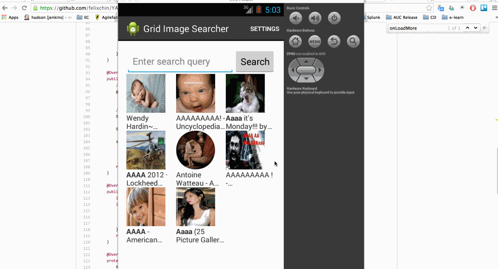

# GridImageSearcher App Demo

This is the second android app for GridImageSearcher.

Time spent: 6 hours spent in total

Completed user stories:
   * User can enter a search query that will display a grid of image results from the Google Image API.
   * User can click on "settings" which allows selection of advanced search options to filter results
   * [x] User can configure advanced search filters such as:
      * Size (small, medium, large, extra-large)
      * Color filter (black, blue, brown, gray, green, etc...)
      * Type (faces, photo, clip art, line art)
      * Site (espn.com)
      * Subsequent searches will have any filters applied to the search results
   * User can tap on any image in results to see the image full-screen
   * [x] User can scroll down “infinitely” to continue loading more image results (up to 8 pages)

Walkthrough of all user stories:

GIF created with [LiceCap](http://www.cockos.com/licecap/).
